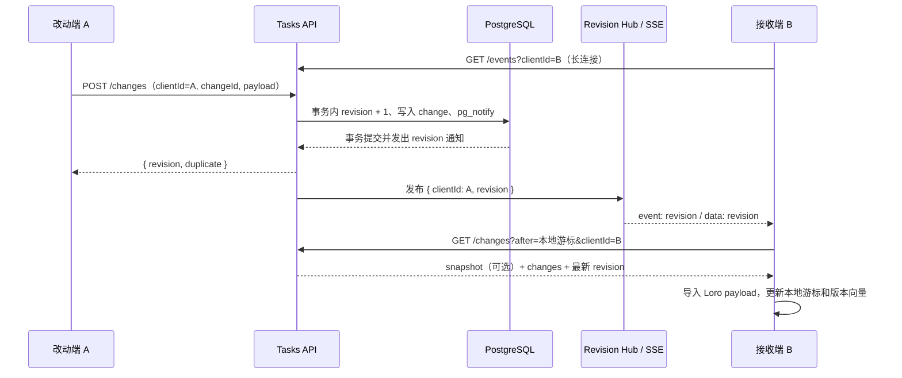
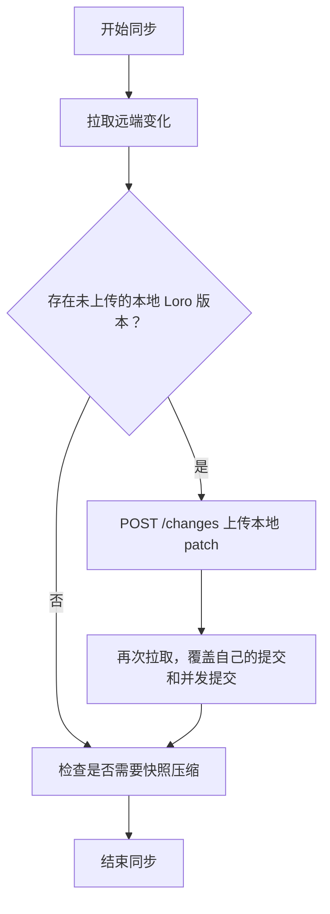

# 自托管同步流程与服务端 API

本文描述 Unthink 当前自托管同步的实际实现，包括改动端、接收端、服务端通知链路、请求数量、异常恢复、快照压缩和附件接口。

## 1. 核心原则

同步系统由两条通道组成：

- SSE 通知通道只发送“某个 space 已提交到 revision N”，不传输 CRDT 数据。
- HTTP 拉取通道通过 `GET /changes` 获取快照和增量 CRDT payload。

因此，SSE 是可能合并、可能中断的唤醒信号，服务端 revision 才是同步进度的事实来源。客户端重连、重新聚焦或漏掉通知后，仍可凭本地游标继续拉取。

任务内容使用 Loro CRDT。服务端只保存不透明的二进制 payload，不解析任务、项目或视图的业务字段。

### 1.1 关键标识和游标

| 名称                    | 所属方         | 含义                                                                   |
| ----------------------- | -------------- | ---------------------------------------------------------------------- |
| `space`                 | 客户端和服务端 | 同步空间，即配置中的 folder；服务端会去除首尾空白并转成小写            |
| `clientId`              | 客户端         | 当前同步配置对应的设备标识；SSE 用它排除自己上传产生的通知             |
| `changeId`              | 客户端         | 单次上传的幂等标识；相同 `clientId + changeId` 重试不会产生新 revision |
| `revision`              | 服务端         | space 内单调递增的提交序号，每次成功追加 change 增加 1                 |
| `serverRevision`        | 客户端         | 客户端已经拉取并处理到的服务端 revision                                |
| `snapshotRevision`      | 客户端和服务端 | 当前快照覆盖到的 revision                                              |
| `uploadedVersion`       | 客户端         | 已知已经存在于服务端或来自服务端的 Loro 版本向量                       |
| `pendingServerRevision` | 客户端内存     | 同步期间收到但可能尚未覆盖的最高 SSE revision                          |

客户端持久化 `clientId`、`serverRevision`、`snapshotRevision` 和 `uploadedVersion`。服务端不保存客户端业务状态，只保存 change、snapshot 和客户端确认游标。

## 2. 总体数据链路



服务端不会向 `clientId` 相同的 SSE 订阅者发送其自己上传产生的通知。但是 `GET /changes` 返回的是 space 的完整 revision 序列，并不会过滤同一 `clientId` 写入的 change。

## 3. 改动端流程

### 3.1 本地改动如何触发同步

本地 TaskModel 发生变化后：

1. Todo 服务发出状态变化事件。
2. 如果该变化不是正在导入的远端变化，客户端以 500 ms 防抖调度一次同步。
3. 500 ms 内的多次本地修改通常被合并进同一个 Loro patch。
4. 如果两次修改跨过不同的防抖/同步周期，服务端可能收到多个 `POST /changes`，因此一次用户操作并不天然等于一个服务端 revision。

同步暂停时不会建立 SSE，也不会执行计划同步；本地变化仍保存在本地数据库，恢复同步后再上传。

### 3.2 一轮同步的请求顺序

当前一轮同步按以下顺序执行：



具体步骤：

1. 先调用 `GET /changes?after=<serverRevision>`。
2. 导入服务端返回的 snapshot 和 changes，并更新 `serverRevision`、`snapshotRevision`、`uploadedVersion`。
3. 比较当前 Loro 版本和 `uploadedVersion`。
4. 如果没有新本地版本，不发送 POST，也不再执行第二次拉取。
5. 如果存在新本地版本，导出从 `uploadedVersion` 开始的 patch，调用 `POST /changes`。
6. POST 成功后更新 `uploadedVersion`，再调用一次 `GET /changes`：
   - 拉回刚刚由自己写入的新 revision，使本地 `serverRevision` 与服务端一致；
   - 捕获首次拉取和 POST 之间其他设备提交的并发变化。
7. 最后检查是否需要生成快照。

先拉后推可以避免基于过旧状态导出 patch；仅在实际执行过 POST 时进行第二次拉取，可以消除纯远端同步中的重复空 GET。

### 3.3 服务端处理改动

服务端收到 `POST /changes` 后，在一个 PostgreSQL 事务中：

1. 按 `(space, clientId, changeId)` 查重。
2. 如果已经存在，返回原 revision 和 `duplicate: true`，不重复写入。
3. 如果不存在，将 space 的 revision 加 1。
4. 写入不可变 change 记录。
5. 调用 PostgreSQL `pg_notify('unthink_revisions', ...)`。
6. 提交事务。
7. 数据库通知监听器把 revision 转交给进程内 Revision Hub。
8. Revision Hub 向该 space 的 SSE 订阅者发布通知，但跳过与改动端相同的 `clientId`。

PostgreSQL 的通知在事务提交后才会投递，因此接收端收到 revision 时，对应 change 已经可以被拉取。

## 4. 收到通知的同步端流程

### 4.1 正常远端通知

接收端长期保持：

```http
GET /api/v1/spaces/{space}/events?clientId=<clientId>
Accept: text/event-stream
Authorization: Bearer <AUTH_TOKEN>
```

远端提交后，接收端收到：

```text
id: 13
event: revision
data: 13
```

客户端随后执行：

1. 如果通知 revision 小于或等于本地 `serverRevision`，直接忽略。
2. 否则记录最高的 `pendingServerRevision`。
3. 当前没有同步时，立即启动同步。
4. 调用一次 `GET /changes?after=<serverRevision>`。
5. 导入返回的所有 payload；导入期间设置 `applyingRemoteChanges`，防止把远端导入误判成新的本地改动。
6. 更新并持久化服务端游标和 Loro 版本向量。
7. 如果接收端没有自己的待上传变化，本轮到此结束，不执行第二次 GET。

纯远端变化的正常网络请求是：

```text
已有的 SSE 长连接收到一条 revision 事件
GET /changes?after=<旧 revision>
```

### 4.2 同步期间又收到通知

如果当前同步尚未结束，新的 SSE 通知不会立即并发启动另一轮同步，而是只更新 `pendingServerRevision` 的最大值。

当前轮结束后：

- `pendingServerRevision <= serverRevision`：说明当前 GET 已经覆盖该通知，不补跑。
- `pendingServerRevision > serverRevision`：说明还有更新未覆盖，调度且只调度一轮后续同步。

这避免了过去“同步中收到 revision 13，当前请求其实已经拉到 13，但结束后仍完整执行两次 `after=13` 空拉取”的情况。

### 4.3 接收端同时有本地改动

如果接收端收到通知时自己也有未上传变化，请求顺序为：

```text
SSE revision 通知
GET  /changes?after=<旧 revision>
POST /changes
GET  /changes?after=<第一次 GET 后的 revision>
```

第二次 GET 是必要的，因为 POST 会为接收端自己的 change 分配一个新 revision，并且期间仍可能有其他设备并发提交。

### 4.4 分页

`GET /changes` 默认每页最多返回 500 条 change。若响应中 `hasMore: true`，客户端用本页最后处理的 revision 继续 GET，直到 `hasMore: false`。

因此积压超过一页时，一次通知会合理地产生多个 GET。

### 4.5 SSE 重连和兜底同步

SSE 只负责及时唤醒，不承担可靠消息队列职责：

- SSE 建立成功后会主动触发一次同步，以覆盖断线期间的变化。
- SSE 断线后按 1 秒起步的指数退避重连，最长 30 秒。
- 普通同步失败按 2 秒起步的指数退避重试，最长 60 秒。
- 浏览器恢复在线、窗口重新获得焦点、页面重新可见时会触发同步。
- 客户端每 60 秒执行一次兜底同步。
- 服务端每 25 秒发送 SSE heartbeat，维持长连接。

服务端 SSE 不根据 `Last-Event-ID` 重放历史事件。重连后的主动 `GET /changes` 和客户端持久化游标负责补齐历史数据。

## 5. 常见场景的请求数量

下表不把已经存在的 SSE 长连接本身计为一次新请求。

| 场景                                    | 请求序列                       | 说明                                  |
| --------------------------------------- | ------------------------------ | ------------------------------------- |
| 仅收到远端变化                          | `GET /changes`                 | 正常情况一次拉取完成                  |
| 仅有本地变化，且本地游标已最新          | `GET → POST → GET`             | 先确认远端，再上传，再确认新 revision |
| 收到远端变化，同时有本地待上传变化      | `GET → POST → GET`             | 合并远端后上传本地并再次追平          |
| 同步中收到已被当前 GET 覆盖的通知       | 不增加请求                     | revision 去重                         |
| 同步中收到更高且未覆盖的通知            | 当前轮结束后增加一轮           | 防止漏掉并发提交                      |
| change 超过一页                         | 多个连续 GET                   | `hasMore` 分页                        |
| 达到快照阈值                            | 正常同步后增加 `PUT /snapshot` | 当前阈值为距上次快照 100 个 revision  |
| SSE 刚连接或重连                        | 一轮同步                       | 覆盖断线窗口                          |
| 页面聚焦、恢复可见、恢复在线、60 秒轮询 | 一轮同步                       | 可靠性兜底，通常是一次空 GET          |

## 6. 快照与旧 change 清理

当 `serverRevision - snapshotRevision >= 100`，且没有未上传的本地版本时，客户端：

1. 导出完整 Loro patch。
2. 调用 `PUT /snapshot`，并传入当前 `serverRevision` 作为 `coversRevision`。
3. 服务端只接受恰好等于当前 space revision 的快照；否则返回 `409 Conflict`，避免保存已经落后的快照。

客户端每次拉取时，服务端会更新 `clients.last_seen_revision`。服务端只会删除同时满足以下条件的旧 changes：

- 已经被 snapshot 覆盖；
- 已经被所有已登记客户端确认。

新客户端或游标早于快照的客户端拉取时，服务端先返回 snapshot，再返回快照之后的 changes。

## 7. 服务端 API

默认 API 前缀为 `/api/v1`。除健康检查和静态网页外，下列同步与附件接口都要求：

```http
Authorization: Bearer <AUTH_TOKEN>
```

### 7.1 接口总览

| 方法   | 路径                                   | 用途                                                |
| ------ | -------------------------------------- | --------------------------------------------------- |
| `GET`  | `/api/v1/health`                       | 检查 API 和 PostgreSQL 是否可用；无需认证           |
| `GET`  | `/api/v1/spaces/{space}/status`        | 查询当前 revision 和 snapshot revision              |
| `GET`  | `/api/v1/spaces/{space}/changes`       | 按游标拉取 snapshot 和 change，并更新客户端确认游标 |
| `GET`  | `/api/v1/spaces/{space}/events`        | 建立 SSE revision 通知流                            |
| `POST` | `/api/v1/spaces/{space}/changes`       | 幂等追加一个 CRDT change                            |
| `PUT`  | `/api/v1/spaces/{space}/snapshot`      | 写入覆盖当前 revision 的 CRDT 快照                  |
| `GET`  | `/api/v1/attachments/config`           | 检测服务端是否提供附件存储                          |
| `PUT`  | `/api/v1/attachments/objects/{key...}` | 上传附件对象                                        |
| `GET`  | `/api/v1/attachments/objects/{key...}` | 下载附件对象                                        |

所有 `{space}` 都会在服务端转为小写并去除首尾空白。

### 7.2 健康检查

```http
GET /api/v1/health
```

成功响应：

```json
{
  "status": "ok",
  "database": "ok"
}
```

数据库不可用时返回 `503 Service Unavailable`。

### 7.3 查询同步状态

```http
GET /api/v1/spaces/{space}/status
```

响应：

```json
{
  "revision": 13,
  "snapshotRevision": 0
}
```

客户端在新增或修改服务器配置时使用此接口验证 endpoint、token 和 space。

### 7.4 拉取变化

```http
GET /api/v1/spaces/{space}/changes?after=9&clientId=<clientId>&limit=500
```

参数：

| 参数       | 默认值 | 限制             | 含义                                                    |
| ---------- | ------ | ---------------- | ------------------------------------------------------- |
| `after`    | `0`    | 非负整数         | 只返回该 revision 之后的数据                            |
| `clientId` | 空     | 客户端应始终传入 | 用于记录该客户端已确认到的 revision，不用于过滤返回内容 |
| `limit`    | `500`  | `1..1000`        | 单页最多返回的 change 数量                              |

响应：

```json
{
  "revision": 13,
  "hasMore": false,
  "snapshot": {
    "revision": 10,
    "payload": "<base64>",
    "createdAt": 1784050000000
  },
  "changes": [
    {
      "revision": 11,
      "clientId": "device-a",
      "changeId": "uuid",
      "payload": "<base64>",
      "createdAt": 1784050001000
    }
  ]
}
```

`snapshot` 仅在客户端的 `after` 早于当前快照时出现。`revision` 是服务端查询时的 space 最新 revision，不一定等于本页最后一个 change；分页时应结合 `hasMore` 和已处理的最后 revision 继续拉取。

### 7.5 SSE revision 通知

```http
GET /api/v1/spaces/{space}/events?clientId=<clientId>
Accept: text/event-stream
```

连接建立时先返回注释：

```text
: connected
```

其他客户端提交后返回：

```text
id: 13
event: revision
data: 13
```

每 25 秒发送：

```text
: heartbeat
```

同一 `clientId` 上传的 revision 不会发给该订阅连接。Revision Hub 的每个订阅者队列只保留最新待处理 revision；这不会丢数据，因为客户端始终按游标拉取全部 changes。

反向代理必须允许流式响应，并禁用该路由的响应缓冲。

### 7.6 追加 change

```http
POST /api/v1/spaces/{space}/changes
Content-Type: application/json

{
  "clientId": "device-a",
  "changeId": "uuid",
  "payload": "<base64 Loro patch>"
}
```

响应：

```json
{
  "revision": 13,
  "duplicate": false
}
```

约束：

- `clientId`、`changeId`、`payload` 必填。
- `payload` 必须是合法 Base64。
- JSON 请求体上限为 16 MiB。
- `(space, clientId, changeId)` 唯一；重复请求返回原 revision 和 `duplicate: true`。

### 7.7 写入快照

```http
PUT /api/v1/spaces/{space}/snapshot
Content-Type: application/json

{
  "clientId": "device-a",
  "coversRevision": 100,
  "payload": "<base64 full Loro patch>"
}
```

成功响应：

```json
{
  "revision": 100,
  "snapshotRevision": 100
}
```

约束：

- `clientId`、`payload` 必填，`coversRevision` 必须为非负整数。
- `payload` 必须是合法 Base64。
- JSON 请求体上限为 16 MiB。
- `coversRevision` 必须等于服务端当前 revision；不相等返回 `409 Conflict`。

### 7.8 附件能力检测

```http
GET /api/v1/attachments/config
```

服务端配置了对象存储时：

```json
{
  "transport": "server"
}
```

未配置附件存储时返回 `404 Not Found`。客户端会继续进行任务同步，并保留已有的自定义 S3 配置。

### 7.9 上传附件对象

```http
PUT /api/v1/attachments/objects/{key...}
Content-Type: <object MIME type>
Content-Length: <bytes>

<binary body>
```

成功返回 `204 No Content`。`Content-Length` 必填；key 不能为空且长度不能超过 2048。服务端把对象流式写入其配置的 S3 兼容存储。

### 7.10 下载附件对象

```http
GET /api/v1/attachments/objects/{key...}
```

成功时返回二进制对象，并设置：

- `Content-Type`
- `Content-Length`
- `Cache-Control: private, max-age=3600`

附件二进制和附件元数据是两条不同链路：对象先通过附件接口上传；上传完成后，附件 key、文件名等元数据写入本地 CRDT，再通过普通任务同步传播到其他设备。

## 8. PostgreSQL 中的数据

| 表          | 作用                                                       |
| ----------- | ---------------------------------------------------------- |
| `spaces`    | 保存 space 名称和当前全局 revision                         |
| `changes`   | 保存不可变 CRDT change；按 space revision 排序             |
| `snapshots` | 每个 space 保存一份最新 CRDT 快照                          |
| `clients`   | 保存每个 client 已确认到的 revision，用于安全清理旧 change |

多 API 实例之间不直接通信。每个实例通过 PostgreSQL `LISTEN unthink_revisions` 接收其他实例提交产生的 `NOTIFY`，再把通知转发到自己持有的 SSE 连接。

## 9. 正确性边界

- SSE 可能被合并或断开，但不会影响最终一致性；GET 游标负责补齐数据。
- 一个 revision 对应一个成功追加的 change，不一定对应一次用户手势。
- `clientId` 用于通知排除、幂等命名空间和确认水位，不是用户身份。
- 服务端不理解 CRDT 内容，冲突合并由客户端 Loro 完成。
- 客户端导入远端变化时不会回声式地再次调度上传。
- 如果接收端自身存在新本地版本，它仍会正常 POST；这不是远端通知的重复请求。
- 只有所有已登记客户端都确认且已有快照覆盖后，服务端才会清理旧 changes。
